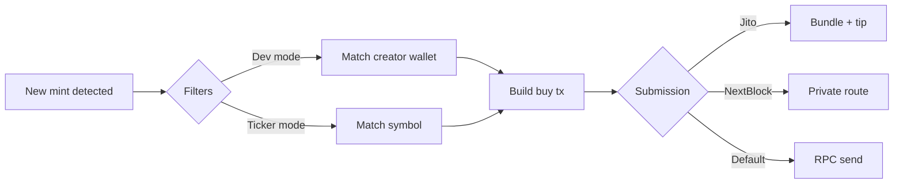

# 0Slot Solana Pump.fun Sniper Bot

A TypeScript bot that monitors [Pump.fun](https://pump.fun) for new token mints and submits buy transactions in the **same block as the launch** when infrastructure is tuned correctly. Filter launches by creator wallet or token symbol, and route buys through Yellowstone Geyser, Jito bundles, or NextBlock to maximize your chance of **0-block** inclusion.

## Why 0-block sniping matters

On Pump.fun, price is driven by the bonding curve from the first buy onward. Wallets that enter in the **mint block** (block 0 relative to the launch) typically get the lowest entry, the largest upside on early momentum, and the least competition from later snipers and bots.

This bot is built to shrink the gap between **mint detected** and **buy confirmed** so your transaction can land alongside—or immediately after—the creator’s mint in the same slot.

| Advantage | What you get |
|-----------|----------------|
| **Earliest entry** | Buy before most RPC-based bots and manual traders see the token on explorers or aggregators. |
| **Better curve price** | Fewer prior buys on the bonding curve means more tokens per SOL at execution time. |
| **Higher upside ceiling** | Early holders benefit most when volume and social attention arrive in later blocks. |
| **Less sandwich risk** | A fast, same-block buy reduces the window for mempools and copy traders to front-run your intent. |
| **Targeted exposure only** | Dev-wallet and ticker filters avoid wasting fees on unrelated mints while you compete for 0-block on the launches you care about. |

### How this bot helps you land on 0-block

1. **Yellowstone Geyser (recommended)** — Subscribes to Pump.fun transactions over gRPC with `confirmed` commitment and reacts on `InitializeMint2` before standard RPC log polling catches up. Lower detection latency is the first requirement for same-block buys.

2. **Immediate buy path** — On a matching mint, the listener stops and a buy is built and sent in one flow—no manual steps between detection and submission.

3. **Jito bundles** — Optional bundle submission with a configurable tip improves the odds your buy is included in the **current** leader’s block instead of waiting behind public mempool traffic.

4. **NextBlock routing** — Optional private submission to NextBlock validators with a tip, aimed at faster propagation and inclusion when public RPC paths are congested.

5. **Processed / confirmed commitments** — Log and Geyser paths use aggressive commitments so mint events are visible as early as your provider allows.

> **Note:** 0-block inclusion is not guaranteed. It depends on your RPC/Geyser quality, network conditions, tip levels, and how early the mint is relative to block production. Use Geyser + Jito or NextBlock together for the best chance; see the [example transaction](#example-transaction) for a successful reference snipe.

## Features

- **0-block oriented stack** — Geyser detection, instant buy trigger, and optional Jito / NextBlock submission paths.
- **Real-time mint detection** — Listens to Pump.fun program logs (standard RPC/WebSocket) or Yellowstone Geyser gRPC for lower latency.
- **Targeted sniping** — Filter by dev wallet address or token ticker/symbol (partial match, case-insensitive).
- **Fast execution** — Optional Jito bundle tips and NextBlock private transaction routing.
- **Configurable buy size** — Set SOL amount per snipe via environment variables.

## How it works



1. The bot subscribes to Pump.fun mint activity (RPC logs or Geyser stream).
2. When a new token is detected, optional filters are applied (dev wallet, ticker).
3. A buy transaction is built and sent via your chosen submission path (Jito, NextBlock, or standard RPC).

## Requirements

- [Node.js](https://nodejs.org/) 18+
- A Solana wallet funded with SOL (for buys, fees, and optional tips)
- An RPC endpoint with WebSocket support (and optionally a Yellowstone Geyser gRPC URL)

## Quick start

1. **Clone and install**

   ```bash
   git clone https://github.com/web3-goals/0slot-pumpfun-sniper-bot
   cd 0slot-pumpfun-sniper-bot
   npm install
   ```

2. **Configure environment**

   ```bash
   cp .env.example .env
   ```

   Edit `.env` with your RPC URL, wallet private key (base58), and buy amount. See [Configuration](#configuration) below.

3. **Run**

   ```bash
   npm run dev
   ```

   For production, build TypeScript first (`npx tsc`) then use `npm start`.

## Configuration

Copy `.env.example` to `.env` and set the values you need.

### Core

| Variable | Description |
|----------|-------------|
| `PRIVATE_KEY` | Base58-encoded secret key of the signing wallet |
| `RPC_ENDPOINT` | HTTP(S) Solana RPC URL (WebSocket is derived automatically) |
| `BUY_AMOUNT` | SOL to spend per snipe (e.g. `0.01`) |

### Detection mode

| Variable | Default | Description |
|----------|---------|-------------|
| `IS_GEYSER` | `false` | Use Yellowstone Geyser gRPC instead of RPC log subscription |
| `GEYSER_RPC` | — | Geyser WebSocket URL (required when `IS_GEYSER=true`) |

Geyser mode reduces detection latency and is **strongly recommended** for 0-block sniping when you have access to a Yellowstone-compatible endpoint. Pair it with `IS_JITO=true` or `IS_NEXT=true` for submission speed.

### Transaction routing

| Variable | Default | Description |
|----------|---------|-------------|
| `IS_JITO` | `false` | Submit buys as Jito bundles with a tip |
| `JITO_FEE` | — | Jito tip amount in SOL (e.g. `0.0001`) |
| `IS_NEXT` | `false` | Route buys through NextBlock |
| `NEXT_BLOCK_API` | — | NextBlock API endpoint / key |
| `NEXT_BLOCK_FEE` | — | Tip paid to NextBlock in SOL |

### Filters

**Dev wallet snipe** — Only buy tokens created by a specific address:

```env
DEV_MODE=true
DEV_WALLET_ADDRESS=<creator_pubkey>
```

**Ticker snipe** — Only buy when the token symbol contains your string:

```env
TICKER_MODE=true
TOKEN_TICKER=PEPE
```

You can enable one or both filters. With both enabled, a mint must pass all active filters.

## Example transaction

Successful snipe (reference):

https://solscan.io/tx/5q1EZZsWWAhAzWqLFY1238Brr6Go1aLTu8G3sAebMWLUZSAnwfnUA7LMvfbPmdcxhbANM7FAWB8DtwTiedPieraR

## Project structure

```
src/
├── index.ts              # Entry: listeners, filters, bot loop
├── constants.ts          # Pump.fun program IDs and layout
├── utils/                # Jito, shared helpers
└── pumputils/            # Buy logic, IDL, bonding curve utils
```

## Disclaimer

This software interacts with live markets on Solana. Trading memecoins is highly risky; you can lose your entire deposit. This project is provided as-is with no warranty. You are solely responsible for securing your keys, RPC access, and compliance with applicable laws. Never commit `.env` or share your private key.

## License

ISC
